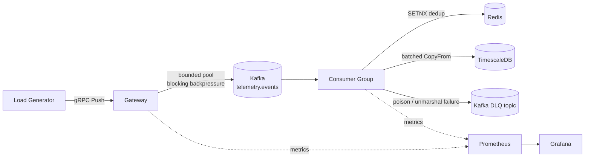
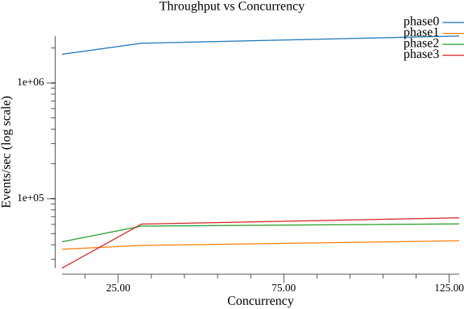
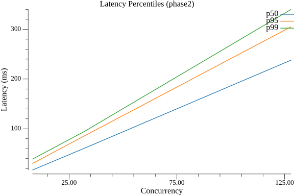
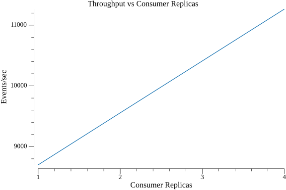
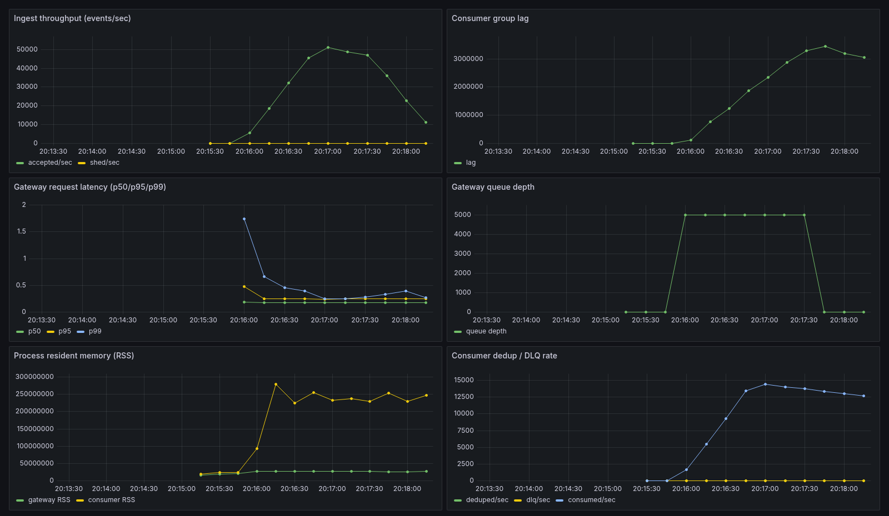

# Sluice

A high-throughput telemetry ingestion pipeline in Go: a gRPC ingest gateway with a bounded worker
pool, backed by Kafka (partitioned, idempotent), a consumer group with Redis dedup and a batched
TimescaleDB sink, a dead-letter topic for poison records, Prometheus/Grafana observability, and a
Kubernetes deployment path via Helm + Terraform + Ansible. It is load-tested to find its own real
ceilings on the machine it was built on, not a machine it was hoped to run on.

## Problem statement

A telemetry ingestion path has one job that's easy to say and hard to keep true under load: don't
lose data, and know exactly how much load you can take before you do. Most demo pipelines either
skip the backpressure story entirely (an unbounded queue that OOMs under load looks fine in a demo
and fails in production) or never measure their own ceiling on real hardware. Sluice is built
around three architectural bets — bounded pool + blocking backpressure, batched writes to every
downstream sink, and idempotent-producer + commit-after-write + dedup for effectively-once delivery
— and every number in this README comes from running the actual pipeline against real infrastructure
on one specific machine, not a synthetic benchmark or a back-of-envelope estimate.

## Why I built this

I operated Kafka-based streaming infrastructure at HPE on RKE2 Kubernetes clusters, with Triton
Inference Server in the mix downstream — which meant plenty of time on the operations side of a
pipeline like this (watching consumer lag, chasing down why a topic's partition count was capping
throughput, debugging why a consumer group rebalance stalled) but not much time actually building
the ingestion path itself. Separately, working on PitWall-AI put me in the telemetry-to-time-series
domain — sensor-like event streams landing in a time-series store for later querying — which is
functionally close to what a lot of production telemetry pipelines actually look like. Sluice is
the ingestion-path project I wanted to build to close that gap: design and build the thing I'd
previously only operated, under real load, with the numbers to back up every claim.

## Architecture



- **Gateway** (`cmd/gateway`): gRPC `Ingest.Push`, a fixed-size buffered channel drained by a fixed
  worker pool (`internal/pool`). `Submit` blocks when the queue is full — backpressure, never a
  silent drop — unless `-shed` is set, which trades that guarantee for never blocking the caller.
- **Kafka** (`internal/sink.KafkaSink`, via `franz-go`, no CGO): one record per event, keyed by
  `device_id` so a device's events stay ordered on one partition, idempotent producer (`acks=all`).
- **Consumer** (`cmd/consumer`, `internal/consumer`): decodes a whole fetched batch, does one
  pipelined Redis dedup check for the batch, persists non-duplicates, flushes the sink, and only
  then commits offsets — commit-after-flush, at-least-once, made effectively-once by the dedup
  layer.
- **TimescaleDB sink** (`internal/sink.TimescaleSink`): batched `pgx` `CopyFrom`, with a two-tier
  retry (whole-batch retry for transient failures, per-row fallback to isolate genuine poison rows)
  before anything is dead-lettered.
- **Dead-letter topic**: unmarshal failures go straight to the DLQ (unrecoverable, no point
  retrying); persist failures get `-max-retries` attempts first.
- **Observability**: `internal/metrics` (Prometheus client) on both processes' `/metrics`;
  Prometheus + Grafana provisioned in `deploy/`.
- **Kubernetes**: `deploy/helm/sluice` deploys only the gateway/consumer pods; Kafka/Timescale/Redis
  stay in docker-compose on the host (see "The Kubernetes split" below for why).

## The Kubernetes split

On this project's reference machine (16GB RAM, disk-constrained — see below), running the full data
infra a second time inside a Kubernetes cluster on top of docker-compose would roughly double the
footprint for no benefit. `deploy/terraform` uses the `tehcyx/kind` and `hashicorp/helm` providers to
create a kind cluster and install the Sluice Helm release in one `terraform apply`; only the
gateway and consumer pods run inside it. Those pods reach docker-compose's host-published Kafka/
Timescale/Redis ports via the kind bridge network's gateway IP (`dataInfra.hostGatewayIP` in
`deploy/helm/sluice/values.yaml`), not via a Kubernetes Service — because those services genuinely
aren't Kubernetes-managed in this topology.

<!-- RESULTS:BEGIN -->

Machine: Intel MacBook Pro, quad-core i5-1038NG7 (8 threads), 16GB RAM, Ubuntu 20.04, native Docker

### Ingest sweep (concurrency {8, 32, 128})

| Phase | Sink | Real Infra | Concurrency | Throughput (events/sec) | p50 (ms) | p95 (ms) | p99 (ms) |
|---|---|---|---|---|---|---|---|
| phase0 | memory | false | 8 | 1768450.0 | 0.4 | 0.9 | 1.2 |
| phase0 | memory | false | 32 | 2202176.7 | 1.5 | 3.1 | 4.2 |
| phase0 | memory | false | 128 | 2542250.0 | 5.3 | 10.5 | 15.2 |
| phase1 | kafka | true | 8 | 36603.3 | 22.7 | 36.3 | 42.7 |
| phase1 | kafka | true | 32 | 39456.7 | 87.9 | 135.8 | 153.4 |
| phase1 | kafka | true | 128 | 43264.2 | 328.2 | 496.0 | 536.6 |
| phase2 | timescale | true | 8 | 42443.3 | 16.9 | 30.1 | 38.9 |
| phase2 | timescale | true | 32 | 57977.7 | 60.6 | 85.3 | 94.3 |
| phase2 | timescale | true | 128 | 60559.4 | 238.0 | 305.1 | 340.0 |
| phase3 | timescale | true | 8 | 25140.0 | 23.5 | 42.5 | 61.9 |
| phase3 | timescale | true | 32 | 60340.0 | 64.0 | 85.7 | 94.2 |
| phase3 | timescale | true | 128 | 68370.4 | 238.7 | 300.4 | 306.4 |

### Correctness

| Test | Result |
|---|---|
| Kafka loss test (broker restart mid-produce) | PASS (produced=200000, consumed=200000) |
| Redis dedup (replay a batch twice) | PASS (distinct_keys=20000, row_count=20000) |
| DLQ (malformed records + pipeline keeps flowing) | PASS (injected=25, in_dlq=25, valid_consumed_after=193453) |
| Backpressure proof (RSS stays bounded under overload) | PASS (ratio=1.775, peak_queue_depth=2000.0) |

### Kubernetes replica scaling

| Replicas | Throughput (events/sec) |
|---|---|
| 1 | 8700.0 |
| 2 | 9556.7 |
| 4 | 11264.5 |

<!-- RESULTS:END -->

> Confirm any number above with one clean manual re-run of the corresponding `scripts/run_phaseN.sh`
> before citing it anywhere — see RESULTS.md (Rule Zero: cite only from a run with saved logs).

**Charts** (regenerated alongside the table above by `make report`, written to `docs/charts/`):





**Live Grafana dashboard** (Phase 3 stack, ~100s of real sustained load peaking near 50k events/sec).
Note the gateway queue depth pegged flat at its 5000 capacity for the whole overload window while
backpressure holds, `shed/sec` flat at zero throughout (calls block, events are never dropped), and
process RSS levelling off rather than growing without bound. Consumer group lag is still draining at
the right edge — the capture ends before it returns to zero:



## Reproducing the benchmarks

Prerequisites: Go 1.24+, Docker + compose plugin, `protoc` (only if regenerating the proto). Phase 4
additionally wants `kubectl`, `helm`, `terraform`, `kind` — all installable user-local with no root,
see `RUN_STATUS.md` for exact install steps used on this project's machine.

```sh
make proto              # regenerate gen/sluice/v1 from proto/sluice/v1/telemetry.proto
make build               # build all binaries into bin/
make test                # offline unit tests, no infra required

./scripts/run_phase0.sh  # gRPC + bounded pool ceiling, no Docker needed
./scripts/run_phase1.sh  # + Kafka, sweep + broker-restart loss test
./scripts/run_phase2.sh  # + Timescale + Redis + DLQ, sweep + dedup test + DLQ test
./scripts/run_phase3.sh  # + Prometheus/Grafana, sweep + backpressure proof
./scripts/run_phase4.sh  # Docker images + Helm/Terraform/Ansible validation + kind scaling sweep

make report               # regenerate this README's results section + docs/charts/*.png
```

Each `run_phaseN.sh` brings up only the docker-compose services that phase needs and tears them
down afterward (`docker compose down`) to respect a 16GB-RAM, disk-constrained machine — see
`RUN_STATUS.md` for the specifics of what that constraint meant in practice on this build.

## Tech stack

| Layer | Choice |
|---|---|
| RPC | gRPC + protobuf |
| Message bus | Kafka (KRaft mode, `apache/kafka`), `github.com/twmb/franz-go` client (no CGO) |
| Dedup | Redis, `github.com/redis/go-redis/v9` |
| Time-series store | TimescaleDB, `github.com/jackc/pgx/v5` |
| Metrics | `github.com/prometheus/client_golang`, Grafana |
| Latency measurement | `github.com/HdrHistogram/hdrhistogram-go` |
| Charts | `gonum.org/v1/plot` |
| Containers | Multi-stage distroless, non-root |
| Orchestration | Kubernetes (kind), Helm, Terraform, Ansible |

## Machine tag

All numbers in this README and in `RESULTS.md`/`bench/results/*.json` were measured on:
**Intel MacBook Pro, quad-core i5-1038NG7 (8 threads), 16GB RAM, Ubuntu 20.04, native Docker.**

## Repo layout

- `proto/`, `gen/` — protobuf source and generated code.
- `cmd/` — `gateway`, `consumer`, `loadgen`, `topicinit`, `losstest`, `injectmalformed`,
  `topiccount`, `report`.
- `internal/` — `pool`, `sink`, `gateway`, `consumer`, `dedup`, `dlq`, `metrics`, `hdr`, `loadgen`,
  `benchmeta`, `results`, `report`.
- `deploy/` — docker-compose, SQL schema, Helm chart, Terraform, Ansible, Prometheus/Grafana config.
- `scripts/` — `gen_proto.sh`, `run_phase{0..5}.sh`.
- `bench/results/` — measured JSON output (gitignored; regenerate by running the phase scripts).
- `docs/` — generated charts and `DEMO.md`.
- `RUN_STATUS.md`, `RESULTS.md`, `DECISIONS.md` — what ran, what was measured, and why each design
  choice was made, accumulated phase by phase.
